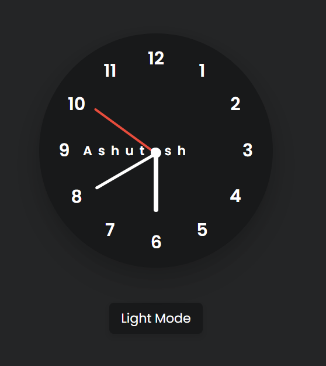
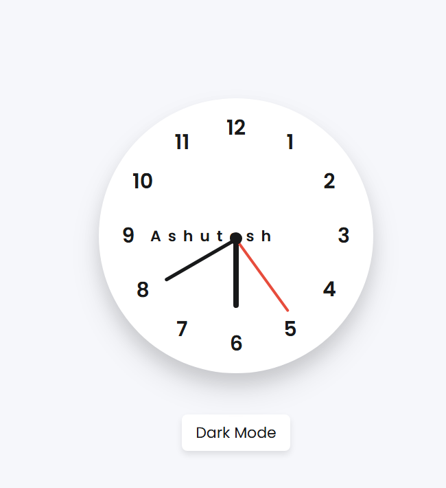

# Analog Clock with Dark Mode 🌙

A beautiful, responsive analog clock built with HTML, CSS, and vanilla JavaScript. Features smooth hand animations, dark/light mode toggle, and custom branding.

## ✨ Features
- Real-time analog clock with hour, minute, and second hands
- Smooth 60fps animations using CSS transforms
- Dark/Light mode toggle with localStorage persistence
- Custom branding (Ashutosh Ranjan) positioned perfectly at clock center
- Fully responsive design
- Clean Poppins font and modern glassmorphism shadows

## 🛠️ Tech Stack
- HTML, CSS, JAVASCRIPT

## 📱 Demo 

## 🚀 Quick Start

1. Clone/Download the project
2. Open `index.html` in any modern browserlight
3. Enjoy your clock! Toggle dark mode with the button below

## 📂 File Structure

## 🎨 Customization
- Change name: Edit `.name` text in HTML
- Colors: Modify CSS custom properties in `:root`
- Position: Adjust `.name` `left/top` values
- Font: Replace Poppins URL in CSS import

## 💡 Key Features Explained
- **CSS Custom Properties**: Seamless dark mode switching
- **localStorage**: Theme persists after refresh
- **CSS Transforms**: 60fps smooth hand rotation
- **Letter-spacing**: Perfect typography for branding

## 📸 Screenshots
| Light Mode | Dark Mode |
|------------|-----------|
|  |  |

## 🙌 Acknowledgments
- Poppins font by Google Fonts
- Built with ❤️ by Ashutosh Ranjan

## 📄 License
MIT License - Feel free to use and modify!